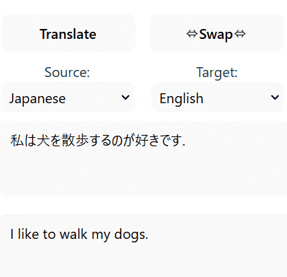

# LocalTranslatorForExcel

- Qiitaの記事 ⇒ [【Officeアドイン編】エクセルでローカルLLM翻訳](https://qiita.com/msms/items/cf6ddb608b13abcdceb9)
- [GitHub Pages ](https://msmsrep.github.io/LocalTranslatorForExcel/dist/) で試す

 

- ローカルで動作する翻訳ExcelのOfficeアドインです
- [dist/manifest.xml](https://github.com/msmsrep/LocalTranslatorForExcel/blob/main/dist/manifest.xml)をサイドロードしてエクセルに追加します
- [Transformers.js](https://huggingface.co/docs/transformers.js/tutorials/react)を使用しています

